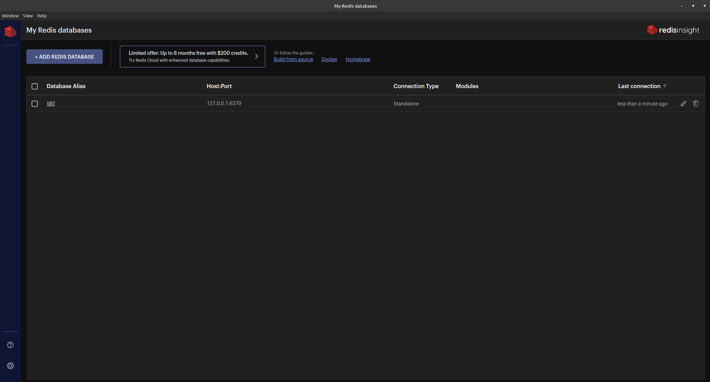
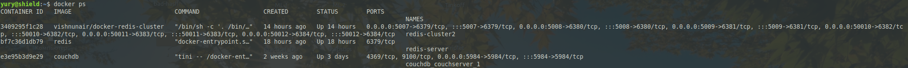

# redis_helloworld

Согласно лекции:

```
docker pull redis
docker run --name redis-server -d redis
docker exec -it redis-server redis-cli
```

Поставил RedisInsight:

```
wget https://download.redisinsight.redis.com/latest/RedisInsight-v2-linux-x86_64.AppImage
chmod a+x RedisInsight-v2-linux-x86_64.AppImage
./RedisInsight-v2-linux-x86_64.AppImage
```

Создал БД SBT на 127.0.0.1:6379 (пришлось ещё запустить redis-server https://stackoverflow.com/questions/42857551/could-not-connect-to-redis-at-127-0-0-16379-connection-refused-with-homebrew)



Все тесты проводил на питоне (нашёл прекрасное описание к библиотеке https://pythonru.com/biblioteki/redis-python), ноутбук с результатами приложил. lpush и rpush работают примерно в два раза быстрее, чем hset, zadd.

"Настроить редис кластер на 3х нодах с отказоустойчивостью, затюнить таймоуты." Я нашёл такую реализацию: https://github.com/vishnudxb/docker-redis-cluster. Потюнил таймоуты через терминал, инструкция есть в документации redis'а на https://redis.io/docs/manual/scaling/.
Итого:


