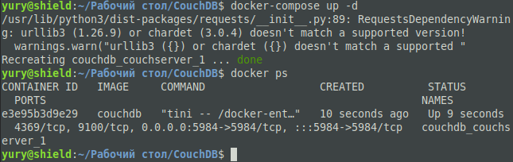
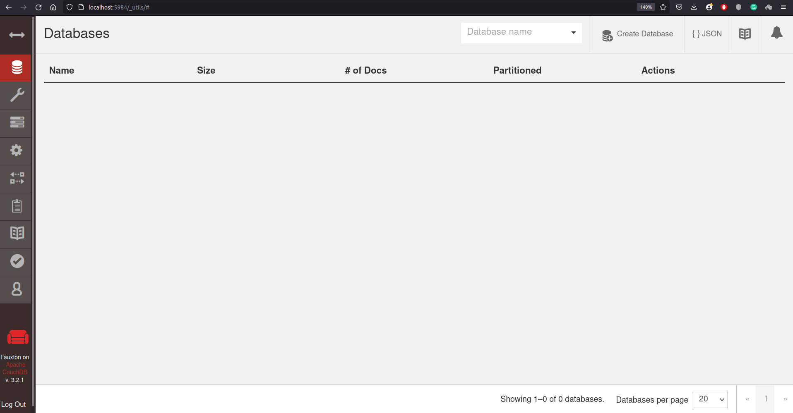
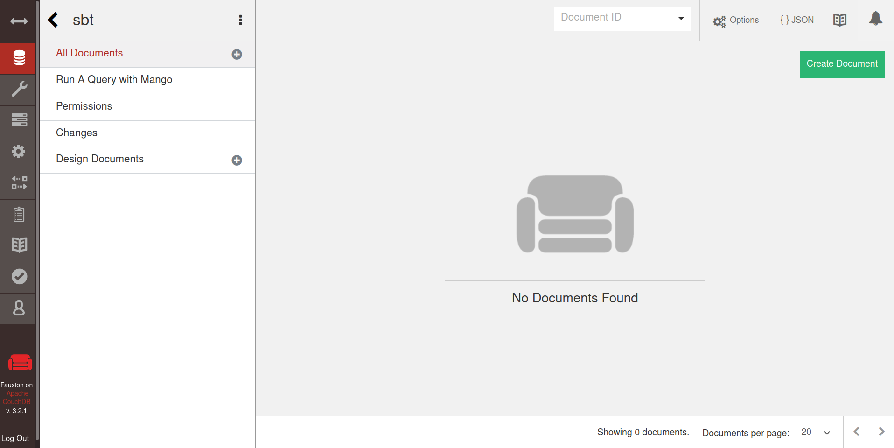
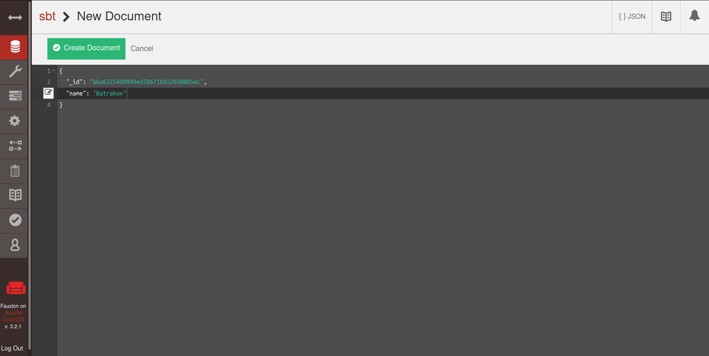
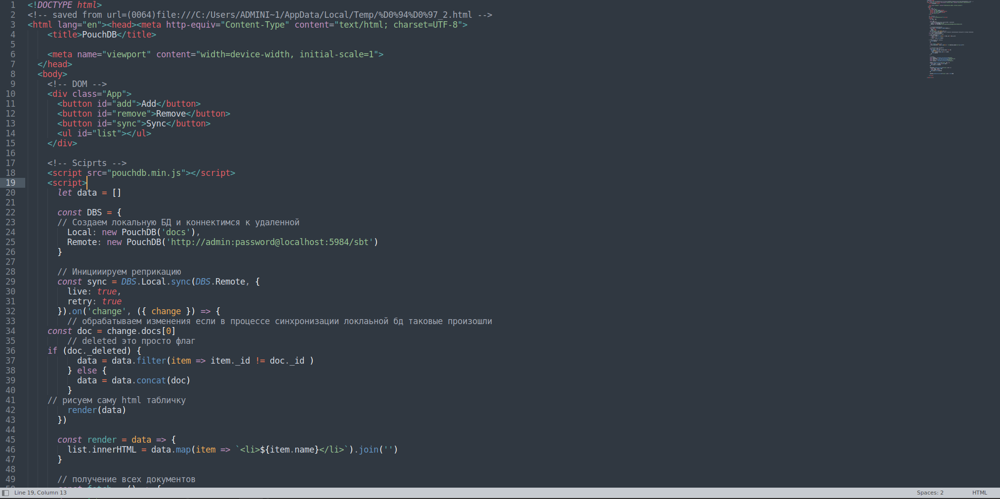
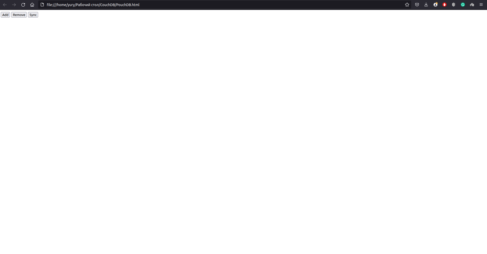
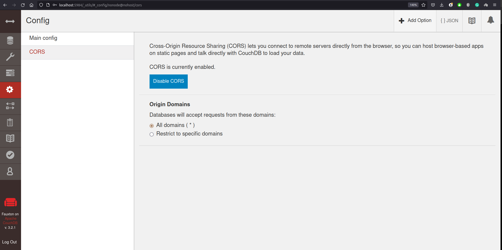

# couchdb-helloworld

Установил CouchDB через докер. И запустил.

Создал базу данных "sbt".

Добавил документ со своей фамилией.

Отредактировал html.

Открыл его в браузере -- не работает.

Настроил CORS.

Заработало.

Видео с демонстрацией тестируемого механизма приложено в репозитории.
