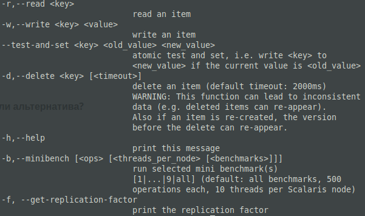
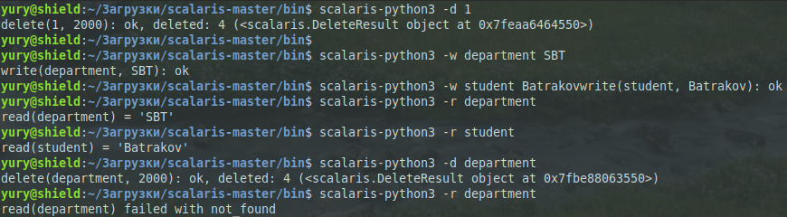
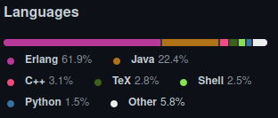
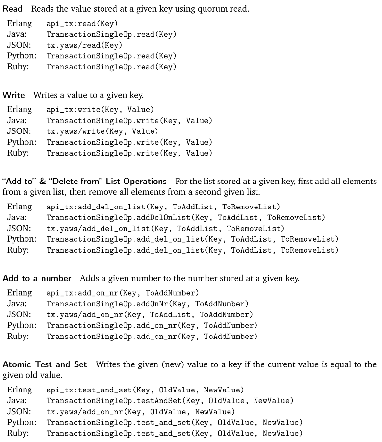
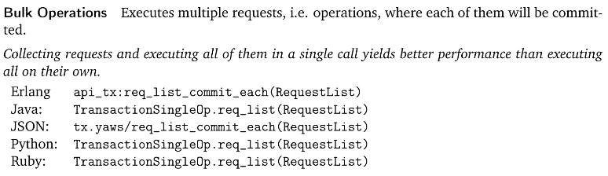
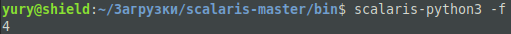

# Scalaris

**История развития СУБД**

Первый коммит был сделан 23 июля 2008. 

Разработчики, которые внесли наибольший вклад в развитие Scalaris:

* [Thorsten Schutt](https://github.com/tschuett)
* [Floarian Schintke](https://github.com/schintke)
* [Jan Skrzypczak](https://github.com/janskrz)
* [Jens Fischer](https://github.com/jvf)

Он был разработан и внедрен Zuse Institute Berlin (ZIB) в сотрудничестве с KTH / SICS в проекте SELFMAN в 2007 году. Затем Scalaris использовался для реализации версии Википедии, которая заняла  первое место в IEEE International Scalable Computing Challenge 2008.

Scalaris был выпущен под открытой лицензией Apache. Компания ZIB onScale занимается поддержкой и настройкой Scalaris.

Scalaris получил финансирование от проектов ЕС:

-  IES Cities
-  4CaaSt
-  Contrail
-  Selfman
-  XtreemOS

Релизы версий:

-  Scalaris 0.9.0 (codename "Vriesea scalaris") - February 29, 2016
-  Scalaris 0.8.2 - July 24, 2015
-  Scalaris 0.8.1 - July 12, 2015
-  Scalaris 0.8.0 (codename "Picoides scalaris") - July 10, 2015
-  Scalaris 0.7.2 - October 23, 2014
-  Scalaris 0.7.1 - September 30, 2014
-  Scalaris 0.7.0 (codename "Stauroderus scalaris") - April 28, 2014
-  Scalaris 0.6.1 - October 11, 2013
-  Scalaris 0.6.0 (codename "Conus scalaris") - August 19, 2013
-  Scalaris 0.5.0 (codename "Saperda scalaris") - October 11, 2012
-  Scalaris 0.4.1 - March 22, 2012
-  Scalaris 0.4.0 (codename "Pomacea scalaris") - January 25, 2012
-  Scalaris 0.3.0 (codename "Rhinechis * Scalaris") - July 15, 2011
-  Scalaris 0.2.0 - 0.2.3

**Установка**

Установить Scalaris можно на Linux и Windows. На Linux это можно сделать либо через

```bash
git clone https://github.com/scalaris-team/scalaris.git
cd scalaris
./configure
make
```

либо установив пакеты RPM и DEB http://download.opensuse.org/repositories/home:/scalaris/ для различных дистрибутивов Linux.

**Инструменты для взаимодействия с СУБД**

Для взаимодействия с Scalaris можно воспользоваться API: Erlang-API, Java-API, generic JSON-API, Python-API, Ruby-API. Так же есть возможность взаимодействовать через Command Line Inteface: Java CLI, Python CLI, Ruby CLI. И непосредственно взаимодействие со Scalaris из Erlang.

**Какой database engine используется в вашей СУБД?**

Используется P2P протокол с распределённой хэш-таблицой, что позволяет работать с БД очень быстро.

**Как устроен язык запросов в вашей СУБД? Разверните БД с данными и выполните ряд запросов.**

Для удобства рассмотрю на примере CLI Python (по остальным команды аналогичы и описаны в документации):



И пример использования:



**Распределение файлов БД по разным носителям?**

Есть, Scalaris вообще распределённая БД, она настраивает сама себя: автономно перемещает элементы в целях равномерного распределения нагрузки по всей системе, чтобы улучшить  время отклика. При развертывании Scalaris в нескольких центрах обработки данных эти алгоритмы используются для размещения часто используемых элементов рядом с пользователями. При чём она легко масштабируема, и серверы могут быть добавлены или удалены на ходу без downtime'а сервиса.

**На каком языке/ах программирования написана СУБД?**

Сам Scalaris напиисан на Erlang, но у него есть разные API, они, очевидно, написаны с использованием соответствующих языков программирования.



**Какие типы индексов поддерживаются в БД? Приведите пример создания индексов.**

Не нашёл информацию.

**Как строится процесс выполнения запросов в вашей СУБД?**

Не нашёл информацию.

**Есть ли для вашей СУБД понятие «план запросов»? Если да, объясните, как работает данный этап.**

Соответственно с предыдущим вопросом, информацию не нашёл.

**Поддерживаются ли транзакции в вашей СУБД? Если да, то расскажите о нем. Если нет, то существует ли альтернатива?**

Да, поддерживаются, Scalaris придерживается ACID (впрочем Consistency поддерживается довольно забавно: переубеждаем меняем 50% + 1 держателей нашего ключа в значении, а при чтении говорим мнение большинства). Все ниже перечисленные команды являются транзакциями




**Какие методы восстановления поддерживаются в вашей СУБД. Расскажите о них.**

Данные реплицируются, множитель репликации можно узнать, например, командой

```bash
scalaris-python3 -f
```

По умолчанию он равен 4.



Если Scalaris обнаруживает сбой узла или сетевую проблему, он немедленно восстанавливает свою оверлейную сеть P2P и базу данных самостоятельно. Задачи управления, такие как добавление или удаление узлов, не требуют или же почти не требуют вмешательства человека. Он настраивает сам себя: автономно перемещает элементы в целях равномерного распределения нагрузки по всей системе, чтобы улучшить время отклика.

**Расскажите про шардинг в вашей конкретной СУБД. Какие типы используются? Принцип работы.**

В Scalaris используется не шардинг, а репликация, так что расскажу про неё. Сервера соединяются в кольцо, а данные реплицируются с логарифмическим шагом, при репликации соблюдается consistency для ACID.

**Возможно ли применить термины Data Mining, Data Warehousing и OLAP в вашей СУБД?**

В Scalaris не реализованы возможности для Data Mining и OLAP; Scalaris не является и Data Warehousing, т.к. она не предметно-ориентированная БД (данные объединяются в категории и хранятся в соответствии с областями, которые они описывают).

**Какие методы защиты поддерживаются вашей СУБД? Шифрование трафика, модели авторизации и т.п.**

О них в документации не написано, так что предполагаю, что их нет, но описана модель того, как пересылаются данные между нодами. Пересылается дельта, а потом отправитель спрашивает у получателя, нормально ли записались данные, и если получатель отвечает, что всё ок, то передача останавливается.

**Какие сообщества развивают данную СУБД? Кто в проекте имеет права на коммит и создание дистрибутива версий? Расскажите об этих людей и/или компаниях.**

Разработкой занимается [Scalaris team](https://github.com/scalaris-team), хотя контрибьютили не только они. В команду входят наиболее активные разработчки проекта:

* [Thorsten Schutt](https://github.com/tschuett) -- глава Scalaris, учился в Гамбурге (дипломированный специалист по экономике и организации торговли – German business administration degree, идентичный MBA) и в Kelley School of Business – Университет Индианы, США (MBA, 1989).
* [Florian Schintke](https://github.com/schintke) -- второй глава Scalaris, глава департамента распределённых алгоритмов
* [Jens Fischer](https://github.com/jvf) -- магистр Zuse Institute Berlin 2016 года (время активности на гитхабе тоже примерно 2016 год)

У них все кроме Thorsten Schutt коммитили сразу в master 🤦. Thorsten Schutt создавал отдельные ветки под разработку, создавал оттуда pull request'ы в master, а затем сам мёрджил.

Новые версии создавал только Nico Kruber -- в данный момент глава по архитектурным решениям в Вервике, Apache Flink Committer, до сентября 2016 года научный сотрудник в Zuse Institute Berlin.

**Создайте свои собственные данные для демонстрации работы СУБД.**


**Как продолжить самостоятельное изучение языка запросов с помощью демобазы. Если демобазы нет, то создайте ее.**

Создал [демобазу](demobase.txt) (Человек, количество леденцов у Человека).

**Где найти документацию и пройти обучение**

В открытых источниках нашёл только официальный [Users and Developers Guide](https://github.com/scalaris-team/scalaris/blob/master/user-dev-guide/main.pdf).

**Как быть в курсе происходящего**

На официальном [github Scalaris](https://github.com/scalaris-team/scalaris) можно поставить остслеживание изменений (Watch в правом верхнем углу).

Так же за информацией о проекте можно следить на их [официальном сайте](http://scalaris.zib.de/).
